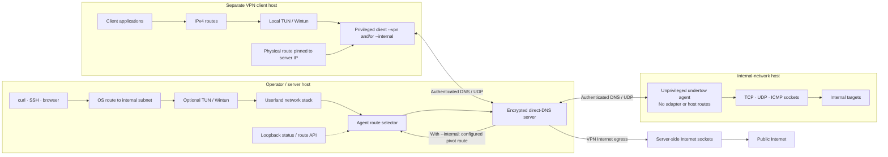

# Undertow

```text
                        ▄▓                    █▄
     ▄                 ░▒░                    ▒▓█                ▄    ▄
█▄   ██▄▄█▄     ▄█ ▄▄▄▄█▓█▄ ▄▄▄▄▄▄▄▄▄█▄▄▄▄▄▄ ▄▓▓█▄▄ ▄▄▄▄▄▄▄▄█▄   ██▄  ██▄▄
█░█  █▓█ ▓░█▄  █▒░█░█  █▓█ █░█ ▄█▀   █░█ ▀█▓█ ▒▓█  █░█  █▓█ █░█  █▓█  ░▓█
▒▓█  ░▓█ ▒▓█ ▀▄░▓█▒▓█  ░▓█ ▒▓█▀ ▄▄   ▒▓█  ▀▀  ░▓░  ▒▓█  ░▓█ ▒▓█  ░▓█  ▒▓█
▀██▄▄▀█▀ ░██   ▀██▀██▄▄▀██ ▀██▄▄▀██▄ ███      ▀██▄▄▀██▄▄▀█▀ ▀██▄▄▀█▀▄▄▀█▀
                 ▀
```

Undertow carries encrypted sessions over direct DNS, HTTPS/WebSocket, or QUIC. A **server** accepts connections, an unprivileged **agent** connects from a network you want to reach, and a privileged **client** tunnels traffic from its own machine. Choose the goal below, then follow the [copy/paste quickstart](docs/quickstart.md).

## What are you trying to do?

| Goal | Components | Start here |
| --- | --- | --- |
| Reach an internal network from the server | Server + agent | `server --tun`, `agent`, `route add` |
| Reach an internal network from a laptop, keeping its Internet route | Server + agent + client | `client --internal` |
| Route a laptop's IPv4 Internet traffic through the server | Server + client | `client --vpn` |
| Use server Internet egress and reach an internal network | Server + agent + client | `client --vpn --internal` |
| Reach one internal TCP service | Server + agent | `server --forward` |
| Expose a client service on an agent host | Server + agent + client | Client console `forward add` |

On **SERVER**, run `undertow init` once to create `identity.key` and `token.key` and print the server fingerprint. Keep `identity.key` on the server; securely copy `token.key` to each **AGENT** or **CLIENT**. Replace `SERVER_IP` and `FINGERPRINT` below. Run `undertow` as `./bin/undertow` when built from this repository.

```sh
# SERVER (root is usually needed for UDP/53)
sudo undertow server --listen 0.0.0.0:53 --identity identity.key --token-file token.key

# AGENT (unprivileged, on a host that can reach internal targets)
undertow agent --server SERVER_IP:53 --fingerprint FINGERPRINT --token-file token.key

# CLIENT (root is needed for TUN; choose a routing mode from the table)
sudo undertow client --internal --server SERVER_IP:53 --fingerprint FINGERPRINT --token-file token.key
```

These commands use the default DNS carrier on separate hosts. For HTTPS/WebSocket on TCP/443 or QUIC on UDP/443, see [transport choices](docs/quickstart.md#choose-a-transport). In a terminal, `server` and `client` each open a console. Type `agents`, `use 1`, `show`, and `routes`; on a client, use `route accept CIDR` for an advertised network or `route add CIDR` for another reachable network. `background` detaches either console without stopping its worker. Return with `undertow server attach` or `undertow client attach`. The server needs `--tun` only when the server host itself will route to an internal network; Internet egress from a client uses server sockets. See [quickstart](docs/quickstart.md) for verification and cleanup by goal.

## How the pieces connect

This diagram uses the default DNS carrier; WebSocket and QUIC replace its wire connection while keeping the session, console, and pivot behavior.



| Mode | Use | Privilege |
| --- | --- | --- |
| `server` | Accept sessions; optional internal route interface | Binding UDP/53 or creating TUN may require elevation |
| `agent` | Reach internal targets through ordinary sockets | None |
| `client --vpn` | Route IPv4 Internet traffic through server sockets | Root/Administrator |
| `client --internal` | Route configured/accepted internal prefixes through agents; keep the Internet route | Root/Administrator |
| `client --vpn --internal` | VPN egress plus server configured agent routes | Root/Administrator |

**Agent and client are different jobs.** Put an `agent` on a host that can reach an internal network; it lets the server open sockets from that host, but changes none of that host's routes. Put a `client` on a host whose *own* applications should use the tunnel. `--vpn` installs two IPv4 `/1` Internet routes and verifies public egress. `--internal` alone installs only internal routes, leaving the client's Internet route unchanged. Combine the flags for both behaviours. After connecting, select an agent in the client console and use `route accept CIDR` for an advertised network or `route add CIDR` for a manual route. No server route command is required for those client routes. `status` lists agents and clients separately.

On the **VPN client host**, choose one mode:

```sh
sudo undertow client --vpn --server SERVER_IP:53 --fingerprint FINGERPRINT --token-file token.key
sudo undertow client --internal --server SERVER_IP:53 --fingerprint FINGERPRINT --token-file token.key
sudo undertow client --vpn --internal --server SERVER_IP:53 --fingerprint FINGERPRINT --token-file token.key
```

For internal-only setup, use the client console after the second command: `agents`, `use 1`, `routes`, then `route accept 10.20.0.0/16` (or `route add 10.20.0.0/16` for a reachable network the agent has not advertised).

For interactive operation, start `undertow server` or `undertow client` in a terminal. Both open their consoles automatically. Type `agents`, then `use 1` to enter an agent and run `shell` for a live terminal, `exec` for one-shot execution, built-in host operations, `upload`, `download`, or route commands without copying its ID. Ctrl-] exits a live shell and returns to the Undertow menu. `help` changes with the menu; `back` returns to the main menu. The server console manages global routes. The client console manages its own accepted and manual routes, which persist across reconnects. On the server, `quit` detaches and `stop` shuts down; on the client, `quit` stops the VPN. Current agent capabilities are enabled by default; `agent --deny=exec,upload` still allows built-in host operations and live shells, while `--deny=hostops` and `--deny=interactive` block those separately. `status` shows supported and allowed operations. See [interactive scenarios](docs/scenarios.md#8-interactive-consoles-and-agent-commands).

For a task that should run while you use the console, select an agent and enter `job start PROGRAM [ARGS]`. Use `jobs`, `job show ID`, `job output ID`, and `job cancel ID` to manage it. Tasks remain visible after client console detach/reattach while the agent stays connected; output is retained up to 256 KiB per job.

Use `run-script bash ./check.sh` or `run-script powershell ./audit.ps1` in a selected-agent console to stream local source into that interpreter on the agent without creating a script file there. Add `--background` before the interpreter to create a job. The independent `scripts` capability can be disabled with `agent --deny=scripts`.

Use `run-wasm ./tool.wasm` or `run-wasm --background ./long-task.wasm` to run a WASI module directly from memory on the selected agent. `--stdin FILE` provides bounded input and words after the module path become module arguments. The independent `wasm` capability controls this operation; the agent caps module size, execution time, guest memory, output and concurrent runs.

Agent inventory includes IPv4 routes with gateways, interfaces, route sources, and a separate default route. In the client console, `routes` shows candidates; after `use 1`, enter `route accept 10.20.0.0/16` for a reported network or `route add 10.20.0.0/16` for a manually known path. No server route command is required for this client-owned setup.

`status` gives a short multi-agent view. Select an agent and type `show`, or run `undertow agent show AGENT_ID` on the server, for connection, transport, route, capability, job, and forwarding details. Add `--json` to the CLI command for structured output.

Uploads and downloads display transfer progress and rate in the client console, including after attach. Press Ctrl-] to cancel a transfer. Completion reports the verified byte count and SHA-256 digest.

For real deployments, use token or password enrollment. With `server --auth none`, anyone who can reach the listener can join, access network paths, and run commands on agents that allow execution.

## Build

Go 1.25 or newer is required to build. Compiled files belong in the ignored `bin/` directory.

Linux:

```sh
mkdir -p bin
go build -buildvcs=false -o bin/undertow ./cmd/undertow
```

Windows PowerShell:

```powershell
New-Item -ItemType Directory -Force .\bin | Out-Null
go build -buildvcs=false -o .\bin\undertow.exe .\cmd\undertow
if ($LASTEXITCODE -ne 0) { throw 'Build failed; bin\undertow.exe may be an older version' }
.\bin\undertow.exe help agent
```

## Guides

- [Goal-oriented quickstart with commands by host](docs/quickstart.md)
- [Exhaustive feature catalogue with commands by machine](features.md)
- [Setup, roles, enrollment and fingerprints](docs/getting-started.md)
- [Scenario commands: pivot, VPN, forwarding and lifecycle](docs/scenarios.md)
- [Interactive console commands and examples](docs/console.md)
- [All commands and flags](docs/cli-reference.md)
- [Protocol version 1](docs/protocol.md)
- [Performance and reliability measurements](docs/benchmarks.md)

Undertow is experimental. Linux VPN egress and Windows-agent pivot TCP, UDP, and ICMP have been exercised on separate hosts. A matched live iodine comparison and a controlled DNS loss/RTT grid are recorded in [the benchmark guide](docs/benchmarks.md). Windows client Wintun installation still needs an elevated live acceptance run. This code is [GPL-3.0-only](LICENSE); bundled third-party components keep their own licences.
