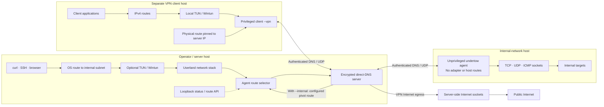

# Undertow

Undertow carries encrypted sessions over direct DNS on UDP. Run an unprivileged **agent** on a network you want to reach, a **server** to accept sessions and select routes, or a privileged **VPN client** to send IPv4 traffic through the server. Server Internet egress uses its own sockets; the server proxy TUN is needed only for routed internal pivots.

## How the pieces connect



| Mode | Use | Privilege |
| --- | --- | --- |
| `server` | Accept sessions; optional internal route interface | Binding UDP/53 or creating TUN may require elevation |
| `agent` | Reach internal targets through ordinary sockets | None |
| `client --vpn` | Route IPv4 Internet traffic through server sockets | Root/Administrator |
| `client --vpn --internal` | VPN egress plus server configured agent routes | Root/Administrator |

## Build

Go 1.25 or newer is required to build. Compiled files belong in the ignored `bin/` directory.

Linux:

```sh
mkdir -p bin
go build -o bin/undertow ./cmd/undertow
```

Windows PowerShell:

```powershell
New-Item -ItemType Directory -Force .\bin | Out-Null
go build -o .\bin\undertow.exe .\cmd\undertow
```

## First connection

Run these on separate hosts. `init` prints the server fingerprint and creates `identity.key` and `token.key`. Copy **only** `token.key` to the agent through a secure channel; keep `identity.key` on the server. Replace `SERVER_IP` and `FINGERPRINT` with your values.

Server:

```sh
./bin/undertow init
sudo ./bin/undertow server --listen 0.0.0.0:53 --identity identity.key --token-file token.key
```

Agent:

```sh
./bin/undertow agent --server SERVER_IP:53 --fingerprint FINGERPRINT --token-file token.key
```

Back on the server, `sudo ./bin/undertow status` shows the connected agent when the elevated server created `control.key`. Run `./bin/undertow help`, `./bin/undertow help server`, `./bin/undertow help agent`, or `./bin/undertow help client` for built-in guidance.

## Guides

- [Setup, roles, enrollment and fingerprints](docs/getting-started.md)
- [Scenario commands: pivot, VPN, forwarding and lifecycle](docs/scenarios.md)
- [All commands and flags](docs/cli-reference.md)

Undertow is experimental. Linux VPN egress and Linux pivot TCP, UDP, and ICMP have been exercised on separate hosts. Windows Wintun and the controlled iodine performance comparison still need acceptance testing. This code is [GPL-3.0-only](LICENSE); bundled third-party components keep their own licences.

