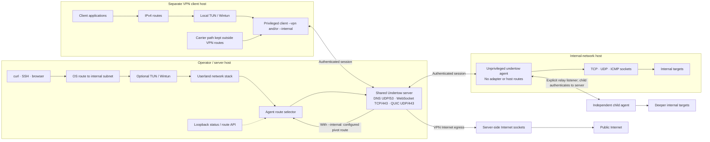

# Undertow

```text
                        ▄▓                    █▄
     ▄                 ░▒░                    ▒▓█                ▄    ▄
█▄   ██▄▄█▄     ▄█ ▄▄▄▄█▓█▄ ▄▄▄▄▄▄▄▄▄█▄▄▄▄▄▄ ▄▓▓█▄▄ ▄▄▄▄▄▄▄▄█▄   ██▄  ██▄▄
█░█  █▓█ ▓░█▄  █▒░█░█  █▓█ █░█ ▄█▀   █░█ ▀█▓█ ▒▓█  █░█  █▓█ █░█  █▓█  ░▓█
▒▓█  ░▓█ ▒▓█ ▀▄░▓█▒▓█  ░▓█ ▒▓█▀ ▄▄   ▒▓█  ▀▀  ░▓░  ▒▓█  ░▓█ ▒▓█  ░▓█  ▒▓█
▀██▄▄▀█▀ ░██   ▀██▀██▄▄▀██ ▀██▄▄▀██▄ ███      ▀██▄▄▀██▄▄▀█▀ ▀██▄▄▀█▀▄▄▀█▀
                 ▀
```

**Undertow is a remote access and network tunneling toolkit.** It connects an operator to remote hosts and networks through an authenticated server, outbound agents, and an optional VPN client. From the server or client console, you can run commands and modules on an agent, transfer files, reach internal services, and route traffic from your own machine through the server or an agent.

An agent runs on a host that can reach the network you need. It connects out to Undertow and uses ordinary sockets to reach targets, so it needs no inbound port, virtual adapter, elevated privileges, or changes to that host's routes. The optional client runs on your own machine and creates a tunnel for your applications. Use `--internal` for networks reachable through agents, `--vpn` for IPv4 Internet access through the server, or both together. The server can also create its own tunnel with `--tun` when applications on the server host need agent routes.

Undertow carries the same encrypted sessions over QUIC, HTTPS/WebSocket, or direct DNS. Agents can connect directly or through another agent acting as a relay. It runs on Linux and Windows; see the [platform and mode details](docs/cli-reference.md) for specific requirements.

**New to Undertow?** Follow [Getting started](docs/getting-started.md). It walks through server initialization, a VPN client, a headless Windows agent, the first command and module, and an internal route.

Client sessions use server-managed [operator accounts](docs/operator-authentication.md). Bootstrap the first Team Leader before starting a fresh server; the console and GUI inherit the authenticated account from the client connection.

Browse the [documentation home](docs/README.md) to find guides by task.

The client also serves an optional local [browser operator workspace](docs/gui.md) by default. It shows live topology and agent workspaces while the terminal console remains fully usable; pass `--no-gui` for terminal-only operation.

## What can it do?

| Need | Undertow provides | Guide |
| --- | --- | --- |
| Reach a service on a remote internal network | An outbound agent and an accepted route from the server or client; TCP, UDP, and ICMP traffic can use the agent's network | [Getting started](docs/getting-started.md#5-route-client-traffic-through-the-agent) · [Routing scenarios](docs/scenarios.md) |
| Route your laptop's traffic | `client --internal` for agent networks, `client --vpn` for server Internet egress, or both | [Networking modes](docs/networking-modes.md) |
| Work on a remote host | Interactive shell, one-shot commands, built-in host operations, file transfer, and background jobs | [Console guide](docs/console.md) |
| Expose a local service through an agent | Let a remote host reach one or several TCP services running on your client | [Remote port forwarding](docs/remote-port-forwarding.md) |
| Run specialized tools | Stream scripts, run WASM modules, or run Windows native modules, BOFs, and .NET Framework assemblies through the agent | [Module bank](docs/module-bank.md) |
| Deploy an unattended agent | Build a Windows or Linux payload, host it over HTTPS, generate a verification script, or download it for your own delivery flow. Each running copy gets its own identity. | [Payload deployment](docs/agent-distribution.md) |
| Deliver a child payload through its parent agent | Use an existing TCP relay or Windows SMB pipe and the parent's authenticated Undertow session | [Agent-hosted payloads](docs/agent-distribution.md#host-a-payload-through-a-connected-agent) |
| Reach a network beyond the first agent | Start an explicit relay and connect another independent agent through it | [Topology and relays](docs/topology-and-relays.md) |
| Connect Windows child agents over an SMB named pipe | Start an explicit pipe on a Windows parent and build a `relay-smb` child | [SMB named-pipe relays](docs/smb-named-pipe-relays.md) |

## How the pieces fit

One server coordinates sessions and routes across all three carriers. Agents can connect directly or through an explicitly enabled relay on another agent.



- **Server:** accepts and authenticates client and agent sessions, hosts deployment payloads, and coordinates commands and routes. Its own `--tun` is optional.
- **Agent:** reaches targets from its host and runs the operations you allow. A configured payload can run headlessly with its connection settings and identity embedded.
- **Client:** runs on the machine whose applications should use the tunnel. It owns its VPN and internal routes; an agent does not change the client machine's routes by itself.

The server and client each have an interactive console. Once an agent connects, select it to run a command, open a shell, inspect its networks, or use a module. See the [full first-run workflow](docs/getting-started.md) for commands on each host, including the server fingerprint check.

## Build and start

Go 1.25 or newer is required. Build the operator binary **and agent templates** from source before creating deployment payloads:

```sh
# Linux
sh tools/build-release.sh bin
./bin/undertow init
sudo ./bin/undertow server --tun
```

```powershell
# Windows PowerShell
.\tools\build-release.ps1
```

The release scripts produce `undertow` (or `undertow.exe`) and Windows/Linux agent templates in `bin/`. The server's `--tun` is needed when applications **on the server** must use routes through an agent; the client creates its own tunnel. Follow [Getting started](docs/getting-started.md) before connecting a client or deploying an agent: it covers enrollment, fingerprint verification, privileges, payload hosting, and a working end-to-end example.

## Reference

The table above links to task-focused guides. For a complete inventory, use the [feature catalogue](features.md) or [CLI reference](docs/cli-reference.md). The [BOF](docs/bof-compatibility.md), [native module](docs/native-modules.md), [WASM](docs/wasm-development.md), and [.NET assembly](docs/assembly-modules.md) guides cover extension formats. For internals and measurements, see the [protocol](docs/protocol.md) and [benchmark guide](docs/benchmarks.md).

Undertow is experimental. The Linux server, Linux VPN client, and Windows agent have been exercised over DNS, HTTPS/WebSocket, and QUIC with TCP, UDP, and ICMP traffic; results are in the [benchmark guide](docs/benchmarks.md). Windows client Wintun installation still needs an elevated live acceptance run. Undertow is [GPL-3.0-only](LICENSE); bundled third-party components retain their own licences.

Back to [documentation home](docs/README.md).
