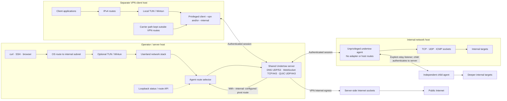

# Undertow

```text
                        ▄▓                    █▄
     ▄                 ░▒░                    ▒▓█                ▄    ▄
█▄   ██▄▄█▄     ▄█ ▄▄▄▄█▓█▄ ▄▄▄▄▄▄▄▄▄█▄▄▄▄▄▄ ▄▓▓█▄▄ ▄▄▄▄▄▄▄▄█▄   ██▄  ██▄▄
█░█  █▓█ ▓░█▄  █▒░█░█  █▓█ █░█ ▄█▀   █░█ ▀█▓█ ▒▓█  █░█  █▓█ █░█  █▓█  ░▓█
▒▓█  ░▓█ ▒▓█ ▀▄░▓█▒▓█  ░▓█ ▒▓█▀ ▄▄   ▒▓█  ▀▀  ░▓░  ▒▓█  ░▓█ ▒▓█  ░▓█  ▒▓█
▀██▄▄▀█▀ ░██   ▀██▀██▄▄▀██ ▀██▄▄▀██▄ ███      ▀██▄▄▀██▄▄▀█▀ ▀██▄▄▀█▀▄▄▀█▀
                 ▀
```

Undertow carries encrypted sessions over QUIC, HTTPS/WebSocket, or direct DNS. A **server** accepts connections, an unprivileged **agent** reaches networks from its host, and a privileged **client** tunnels traffic from its own machine. Start with the [short QUIC quickstart](docs/quickstart.md).

For remote deployment, the separate [configured thin agent](docs/agent-distribution.md) runs with no CLI arguments. From a server or client console, create a profile, build a platform artifact from a prebuilt template, and optionally host it for retrieval. The full `undertow agent` command remains available for manual operation.

## What are you trying to do?

| Goal | Components | Start here |
| --- | --- | --- |
| Reach an internal network from the server | Server + agent | `server --tun`, `agent`, `route add` |
| Reach an internal network from a laptop, keeping its Internet route | Server + agent + client | `client --internal` |
| Route a laptop's IPv4 Internet traffic through the server | Server + client | `client --vpn` |
| Use server Internet egress and reach an internal network | Server + agent + client | `client --vpn --internal` |
| Reach one internal TCP service | Server + agent | `server --forward` |
| Expose a client service on an agent host | Server + agent + client | Client console `forward add` |
| Reach a deeper network through another agent | Server + parent agent + child agent | Parent console `relay start` |

On **SERVER**, run `./bin/undertow init` once. Keep `identity.key` there, copy `token.key` to each **AGENT** or **CLIENT**, and record the printed fingerprint. Replace `SERVER_IP` and `FINGERPRINT` below. These are the minimal Linux commands for direct IP and the default temporary self-signed TLS certificate:

```sh
# SERVER; accepts QUIC UDP/443, WebSocket TCP/443, DNS UDP/53
sudo ./bin/undertow server

# AGENT; only when an internal network is needed
./bin/undertow agent --transport quic --server SERVER_IP:443 --fingerprint FINGERPRINT --tls-insecure-skip-verify

# CLIENT; choose --vpn, --internal, or both
sudo ./bin/undertow client --vpn --transport quic --server SERVER_IP:443 --fingerprint FINGERPRINT --tls-insecure-skip-verify
```

The server accepts all three carriers by default; peers choose one independently. `--vpn` sends the client's IPv4 Internet traffic through the server and needs no agent. `--internal` routes only selected agent networks and keeps the client's normal Internet route. Combine them for both. The **server needs `--tun` only when applications on the server host itself need routed access through an agent**. Every client mode creates its own TUN and works without a server TUN. In a terminal, `server` and `client` each open a console. For an internal route, type `agents`, `use 1`, `show`, `routes`, then `route accept CIDR` or `route add CIDR` on the client. `background` detaches without stopping; `server attach` or `client attach` returns. See the [quickstart](docs/quickstart.md) for verification, stopping, and WebSocket/DNS alternatives.

## How the pieces connect

One server process shares its identity, console, routing and jobs across all enabled listeners. Agents can be direct or connect through an explicitly enabled relay on another agent.



| Mode | Use | Privilege |
| --- | --- | --- |
| `server` | Accept sessions; optional internal route interface | Binding UDP/53 or creating TUN may require elevation |
| `agent` | Reach internal targets through ordinary sockets | None |
| `client --vpn` | Route IPv4 Internet traffic through server sockets | Root/Administrator |
| `client --internal` | Route configured/accepted internal prefixes through agents; keep the Internet route | Root/Administrator |
| `client --vpn --internal` | VPN egress plus server configured agent routes | Root/Administrator |

**Agent and client are different jobs.** Put an `agent` on a host that can reach an internal network; it lets the server open sockets from that host, but changes none of that host's routes. Put a `client` on a host whose *own* applications should use the tunnel. `--vpn` installs two IPv4 `/1` Internet routes and verifies public egress. `--internal` alone installs only internal routes, leaving the client's Internet route unchanged. Combine the flags for both behaviours. After connecting, select an agent in the client console and use `route accept CIDR` for an advertised network or `route add CIDR` for a manual route. No server route command is required for those client routes. `status` lists agents and clients separately.

On the **VPN client host**, choose one mode using the QUIC client command above: `--vpn` for Internet egress, `--internal` for agent networks, or `--vpn --internal` for both. Keep `--transport quic --server SERVER_IP:443 --fingerprint FINGERPRINT --tls-insecure-skip-verify` for this direct-IP, self-signed setup.

For internal-only setup, use the client console after the second command: `agents`, `use 1`, `routes`, then `route accept 10.20.0.0/16` (or `route add 10.20.0.0/16` for a reachable network the agent has not advertised).

For interactive operation, start `undertow server` or `undertow client` in a terminal. Both open their consoles automatically. Type `agents`, then `use 1` to enter an agent and run `shell` for a live terminal, `exec` for one-shot execution, built-in host operations, `upload`, `download`, or route commands without copying its ID. Ctrl-] exits a live shell and returns to the Undertow menu. `help` shows a full command menu for the current level; agent actions appear after `use`. `help relay`, `help route`, and other topics show detailed usage. `clear` or `cls` clears the screen. Tab completes local module, script, and transfer paths. `back` returns to the main menu. The server console manages global routes. The client console manages its own accepted and manual routes, which persist across reconnects, and supports `vpn on|off|status` and `internal on|off|status` while running. On the server, `quit` detaches and `stop` shuts down; on the client, `quit` stops the VPN. Current agent capabilities are enabled by default; `agent --deny=exec,upload` still allows built-in host operations and live shells, while `--deny=hostops` and `--deny=interactive` block those separately. `status` shows supported and allowed operations. See [interactive scenarios](docs/scenarios.md#8-interactive-consoles-and-agent-commands).

For a task that should run while you use the console, select an agent and enter `job start PROGRAM [ARGS]`. `jobs` shows numbered tasks; use `jobs 1` for details, `job output 1` to read output, or `job cancel 1` to stop one. Full job IDs work too. Tasks remain visible after client console detach/reattach while the agent stays connected; output is retained up to 256 KiB per job.

Use `run-script bash ./check.sh` or `run-script powershell ./audit.ps1` in a selected-agent console to stream local source into that interpreter on the agent without creating a script file there. Add `--background` before the interpreter to create a job. The independent `scripts` capability can be disabled with `agent --deny=scripts`.

Use `run-wasm ./tool.wasm` or `run-wasm --background ./long-task.wasm` to run a WASI module directly from memory on the selected agent. `--stdin FILE` provides bounded input and words after the module path become module arguments. The independent `wasm` capability controls this operation; the agent caps module size, execution time, guest memory, output and concurrent runs. Modules can use the public `undertow_host_v1` imports for agent-side host and network assessment. See the [WASM developer guide](docs/wasm-development.md) and [six packaged examples](examples/wasm/README.md).

On Windows amd64 agents, `run-native examples/native/wininfo/wininfo.module` runs a native DLL module with direct Windows API access. `run-native --background` uses the same jobs system, and `--data FILE` passes opaque binary data. The independent `native` capability controls execution. See the [native module guide](docs/native-modules.md), [SDK](sdk/native/README.md), and [examples](examples/native/README.md).

Existing Windows AMD64 BOFs can run directly as COFF `.o` files with `run-bof examples/bof/hello.o`, or be inspected locally with `undertow bof inspect examples/bof/hello.o`. `run-bof --background` uses the same jobs and `native` capability. Use `--format` or an optional sidecar manifest for Beacon arguments. See the [BOF compatibility guide](docs/bof-compatibility.md) and [examples](examples/bof/README.md). WASM, Undertow native modules, and BOFs are separate extension formats with shared agent transport and job output.

For repeated use, `load bof examples/bof/arguments.o` registers `arguments` as a command in the current console session. Its sidecar supplies argument types and help, so after selecting an agent you can type `arguments 123 7 hello world base64:AAEC` or add `--background`. Use `bofs` to list loaded commands and `unload bof arguments` to remove one. With no sidecar, give `--format` once when loading. Registrations stay local to that console process and are not persisted.

Agent inventory includes IPv4 routes with gateways, interfaces, route sources, and a separate default route. In the client console, `routes` shows candidates; after `use 1`, enter `route accept 10.20.0.0/16` for a reported network or `route add 10.20.0.0/16` for a manually known path. No server route command is required for this client-owned setup.

`status` gives a short multi-agent view. Select an agent and type `show`, or run `undertow agent show AGENT_ID` on the server, for connection, transport, route, capability, job, and forwarding details. Add `--json` to the CLI command for structured output.

Uploads and downloads display transfer progress and rate in the client console, including after attach. Press Ctrl-] to cancel a transfer. Completion reports the verified byte count and SHA-256 digest.

For real deployments, use token or password enrollment. With `server --auth none`, anyone who can reach the listener can join, access network paths, and run commands on agents that allow execution.

## Build

Go 1.25 or newer is required to build. Compiled files belong in the ignored `bin/` directory.

Linux:

```sh
mkdir -p bin
go build -buildvcs=false -o bin/undertow ./cmd/undertow
```

Windows PowerShell:

```powershell
New-Item -ItemType Directory -Force .\bin | Out-Null
go build -buildvcs=false -o .\bin\undertow.exe .\cmd\undertow
if ($LASTEXITCODE -ne 0) { throw 'Build failed; bin\undertow.exe may be an older version' }
.\bin\undertow.exe help agent
```

## Guides

- [Goal-oriented quickstart with commands by host](docs/quickstart.md)
- [Exhaustive feature catalogue with commands by machine](features.md)
- [Setup, roles, enrollment and fingerprints](docs/getting-started.md)
- [Scenario commands: pivot, VPN, forwarding and lifecycle](docs/scenarios.md)
- [Interactive console commands and examples](docs/console.md)
- [All commands and flags](docs/cli-reference.md)
- [Protocol version 1](docs/protocol.md)
- [Performance and reliability measurements](docs/benchmarks.md)

Undertow is experimental. A Linux server, Linux VPN client, and Windows agent have been exercised over DNS, HTTPS/WebSocket, and QUIC with TCP, UDP, and ICMP traffic. A matched live iodine comparison and a controlled DNS loss/RTT grid are recorded in [the benchmark guide](docs/benchmarks.md). Windows client Wintun installation still needs an elevated live acceptance run. This code is [GPL-3.0-only](LICENSE); bundled third-party components keep their own licences.
