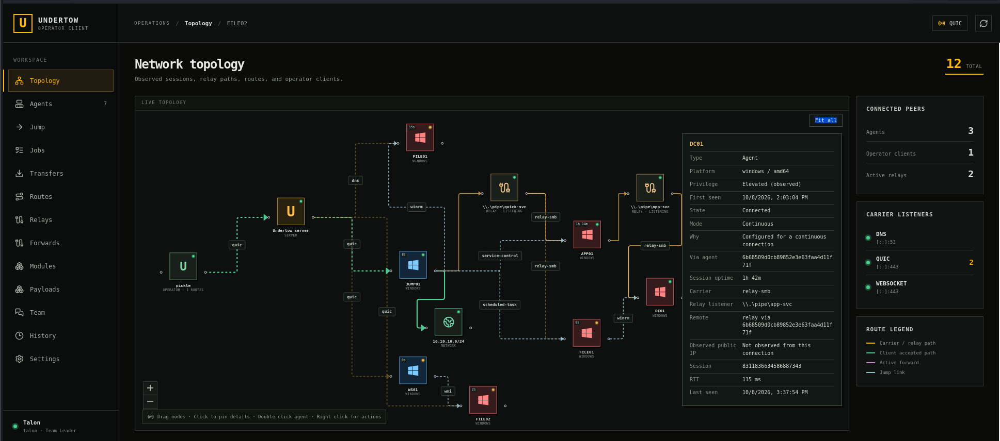
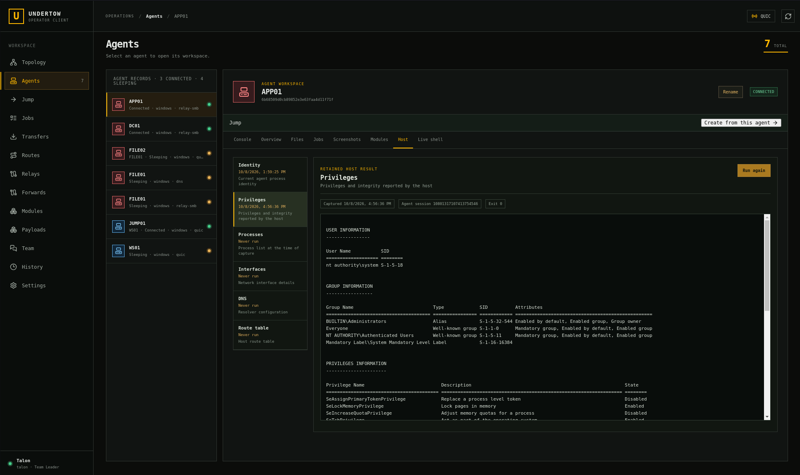
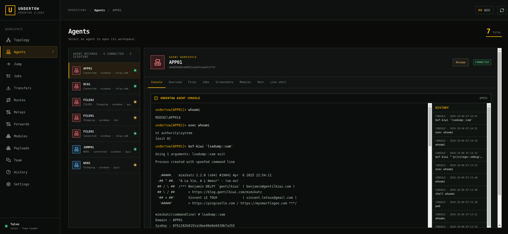
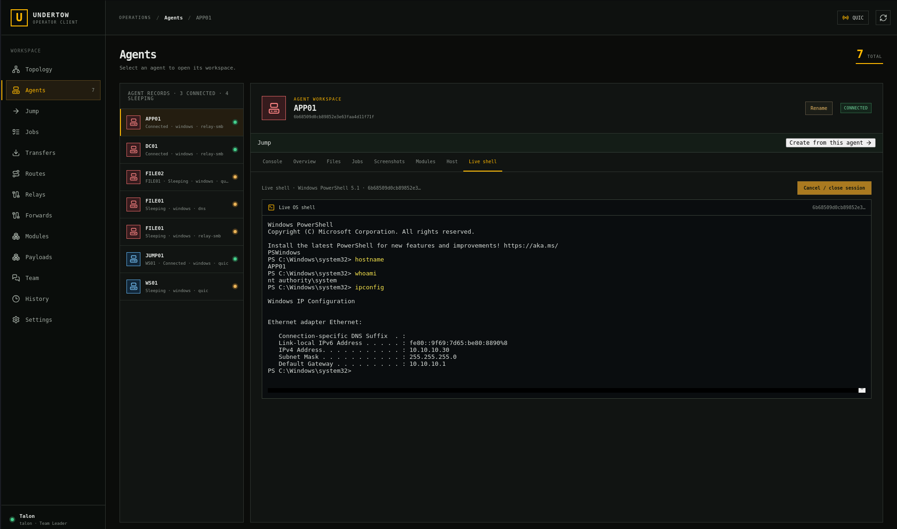
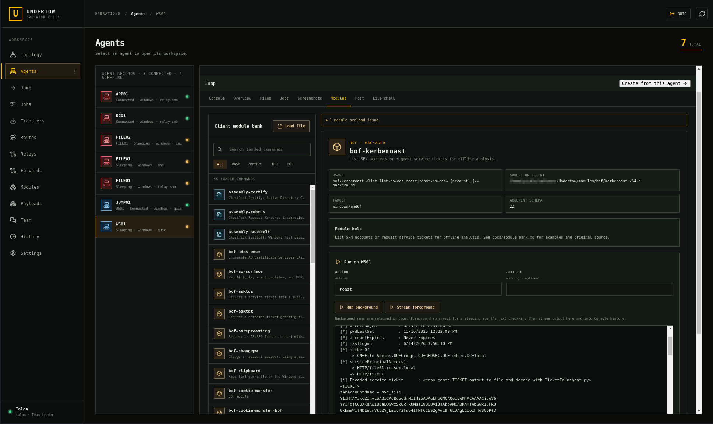
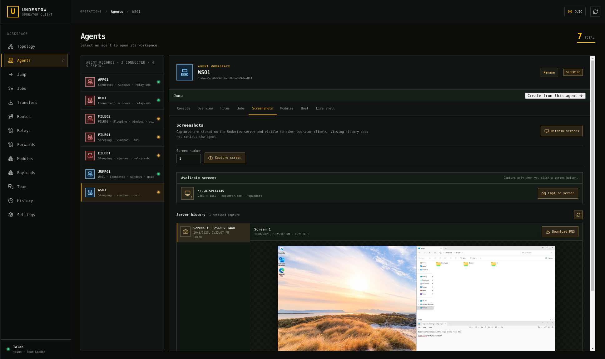
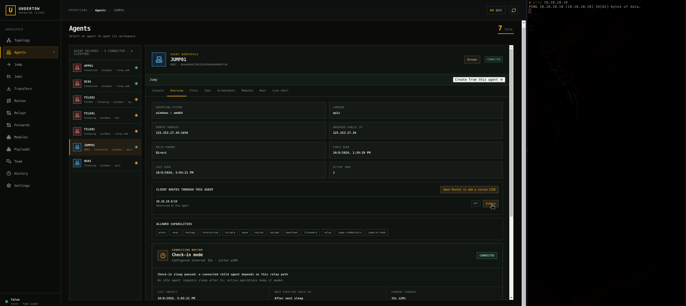

# Undertow GUI user guide

The browser GUI is Undertow's primary operator interface. Use it to work on remote hosts, run tools, deploy agents, and route applications into remote networks. The [terminal console](console.md) remains available for command-line workflows.

Complete [Getting started](getting-started.md) for your first server, client, and agent. Here, **Agents → your agent → Files** means select **Agents** in the sidebar, select a record, then open its **Files** tab. Screenshots show an example engagement; your hosts, addresses, and tools will differ. Click an image for full size.

## Open the workspace

Start an authenticated client and open the complete `GUI available:` URL it prints in a browser **on that client machine**. For agent operations without local network routing:

```sh
undertow client --operator-only --transport quic --server SERVER_IP:443 \
  --fingerprint FINGERPRINT --tls-insecure-skip-verify --token-file token.key \
  --operator alice --operator-password-file alice.password
```

Replace the address, fingerprint, and account with your deployment values. The private operator password file is separate from enrollment credentials; see [Operator accounts](operator-authentication.md).

| What you want to do | Client mode |
| --- | --- |
| Operate agents, files, tools, and deployments without a local tunnel | `--operator-only`; no TUN device or routing privileges required |
| Reach agent networks from applications on your machine | `--internal`; requires elevated TUN/Wintun setup |
| Send your machine's IPv4 Internet traffic through the server | `--vpn`; requires elevated TUN/Wintun setup |
| Use both paths | `--vpn --internal` |

The GUI starts by default; `--no-gui` starts a terminal-only client. Closing the browser leaves the worker, routes, agents, and background jobs running. Type `background` in the attached client console to detach it. Type `quit` there, or run `undertow client --stop` from an OS terminal, to stop the client and remove owned routes. Stopping a client ends its live streams and forwards; agents keep running.

Recover the URL with `undertow client gui` in an **OS terminal on the client machine**. Add `--pid-file PATH` for a custom worker PID file. `undertow client attach` also prints it. For **Session expired** or **Open a fresh GUI link**, reopen the complete URL, including its `#` suffix. Browser expiry does not disconnect agents.

Keep the URL private: it grants local workspace access. The service binds to numeric loopback. The browser talks to the client, which talks to the server. The server's HTTPS payload address is for downloads, not for opening this GUI.

## Find your way around

| Sidebar page | Use it for |
| --- | --- |
| **Topology** | Server, operator clients, agents, relay paths, accepted networks, forwards, and Jump relationships |
| **Agents** | Select a host and use Console, Overview, Files, Jobs, Screenshots, Modules, Host, or Live shell |
| **Jump** | Prepare and track Windows deployment through an existing agent |
| **Credentials** | Manage encrypted engagement passwords and NT hashes for authorised operations |
| **Networking** | Inner pages for **Routes**, **Relays**, and **Forwards** |
| **Tools & jobs** | Inner pages for **Jobs**, **Transfers**, and **Modules** |
| **Payloads** | Profiles, agent builds, custom artifacts, downloads, hosting, and deploy helpers |
| **Team** | Shared/direct messages and assignments |
| **Settings** | Client modes, carriers, archives, accounts, connection status, server logs, and **History** |

Each group remembers the inner page you last used. Links from other pages open their exact destination and select its sidebar group. Password and NT-hash fields start masked; use the eye button to show or hide the text you enter.

For a first session, check **Settings → Connection status**, select an agent, read **Overview**, then run **Host → Identity**. Opening workspaces or reading retained results does not automatically execute commands or capture images.

## Read the topology

[](../assets/topology.png)

The graph shows how agents connect and which network paths clients accepted. A *carrier* is the transport, such as DNS, QUIC, or WebSocket. A parent relay carries a child's connection back to the same server.

1. Hover a node/line for details; click to pin its panel. Click the background to clear it. Scroll inside long panels.
2. Drag nodes to arrange your locally saved layout. Use **Fit all** and zoom controls to navigate.
3. Double-click an agent for its workspace. Right-click objects for relevant actions, such as rename, stop a relay, or remove a route accepted by this client.

Read the legend: carrier/relay paths connect sessions; green paths show accepted routes; purple paths show forwards; light blue dashed links show Jump deployment relationships. A Jump link records where an agent was deployed from; its live connection can use another path. Hover lines for carriers and accepting clients.

Agent icons are blue for standard process privileges, red for elevated, and neutral when unknown. The dot and text separately show connected, sleeping, or disconnected. Coarse privilege comes from inventory or a successful retained Privileges result; use **Host → Privileges** for detail.

Only client-accepted routes appear as network paths. Advertisements and server routes do not prove your client has installed a route: check **Networking → Routes**. New relay sessions identify their particular TCP/SMB listener; older records without enough information retain their known parent path without guessing.

Observed remote addresses can belong to NAT and need not be reachable from your workstation. Agent public IP appears only when the server observed a globally routable source. Set the intended server public address under **Settings → Carriers**; Undertow does not discover it through an external IP service.

## Choose and identify an agent

Open **Agents** and select a record. Connected and intentionally sleeping agents accept work; disconnected records retain history. Hostname and agent-ID ordering stays stable as agents sleep and wake.

Read **Overview** for hostname, ID, OS/architecture, carrier, relay parent, contact times, advertised routes, and allowed capabilities. **First seen** is the first recorded connection for that identity; **At least since** is a lower bound for an older record.

Use **Rename** for a shared nickname without changing hostname or ID; clear it to restore the hostname label. Distinguish agents with the same hostname by ID, nickname, and path. A newly started configured process has a new identity.

For disconnected agents, you can still read Console history, Jobs, Screenshots, Host results, and the last known Overview. Controls that contact them are unavailable. An allowed operation can still fail if the agent's OS, installed programs, permissions, or desktop do not meet its prerequisites.

**Allowed capabilities** are the agent's configured feature permissions. They are separate from Windows/Linux account privileges and from your Operator/Team Leader role. An operator can deny them in a payload profile or with manual agent `--deny`; denying one does not implicitly deny all the others.

| Capability | Controls |
| --- | --- |
| `pivot` | TCP, UDP, and ICMP socket access through the agent |
| `exec` | One-shot OS programs |
| `hostops` | Built-in identity, process, environment, filesystem, network, and display operations |
| `interactive` | Live shells and ordinary process Jobs |
| `scripts`, `wasm` | Script and WASM execution respectively |
| `native` | Native modules, BOFs, and .NET Framework assemblies |
| `native-shell` | Reports support for in-process native live shells; it is available when both `native` and `interactive` are enabled on a current agent. |
| `upload`, `download` | File transfer in each direction; screenshot retrieval also needs download |
| `listeners`, `relay` | Client-service forwards and child-agent listeners respectively |
| `jump-credentials`, `jump-nt-hash` | Supplied Windows credentials and NT-hash authentication for Jump |

For example, denying `exec` leaves built-in host operations and interactive shells available unless their capabilities are also denied. The agent still executes permitted operations with its own OS identity. See [Capability policy](../features.md#granular-agent-capabilities).

## Inspect the host

1. Open **Agents → your agent → Host**.
2. Choose **Identity**, **Privileges**, **Processes**, **Interfaces**, **DNS**, or **Route table**.
3. Read the stored result and capture time; **Never run** means none exists.
4. Click **Run** or **Run again** for a fresh snapshot. Leave a sleeping-agent request open for its callback.

[](../assets/agents.png)

A new run replaces that operation's last result on the server. Switching tabs does not rerun it. **Previous session** marks an older session's result. Check capture time before relying on a snapshot. Console also provides host built-ins, including environment and file operations; see [Host commands](console.md#built-in-agent-host-operations).

## Run a command in Console

**Agents → your agent → Console** is an Undertow menu bound to that agent. Type `help` for operations or `help COMMAND` for usage. Start with:

```text
whoami
pwd
interfaces
```

Run an OS program with `exec cmd.exe /c whoami` on Windows or `exec /usr/bin/id` on Linux. `exec` starts the named program directly, with a 30-second limit and bounded output. For pipes/redirection, explicitly choose a shell or use **Live shell**. Undertow parses quotes but does not expand shell variables.

[](../assets/console.png)

Loaded tools also appear in help. The screenshot combines commands and a BOF run; consult each tool's help for its arguments. Output stays with its command. The client preserves bounded history across restarts, including foreground Modules output: 1,000 entries per agent, up to 64 KiB per entry.

The agent Console supports execution, scripts, all four module runtimes, host operations, files, screenshots, Jobs, Jump, lifecycle, relays, routes, and forwards. Navigation such as `use`, `back`, and `quit` belongs to the terminal main menu. GUI Console `shell` opens the **Live shell** panel; choose a process and click **Start live shell** there. Terminal `shell [PROGRAM ARGS]` opens the interactive session directly.

Direct-file paths such as `run-script powershell PATH` are on the **Undertow client host**, not the agent. Dedicated Files/Modules upload controls choose browser files. See [Console guide](console.md) for complete syntax.

For Console Job commands, use the full ID printed by `jobs`, such as `job show JOB_ID` or `job output JOB_ID`. Use **Tools & jobs → Jobs** to download complete output or BOF files. Terminal Job numbers, `job save`, and `job file` are not GUI Console commands.

Sleeping agents run supported foreground requests at their next callback. Keep browser/client open; further commands can be submitted while waiting, with results matched in submission order. These requests do not automatically become Jobs.

### Run a local script

1. Put your Bash or PowerShell script on the **client host** and note its path. Script paths are local; they do not refer to an uploaded agent file.
2. In the selected agent's Console, use `run-script bash /path/check.sh` for Linux, or `run-script powershell /path/check.ps1` for Windows. The interpreter must be installed on the target.
3. For retained background output, use `run-script --background powershell /path/check.ps1` and inspect its Job. Use the foreground form when you want output returned to the current request.

Undertow streams source into the interpreter's stdin rather than creating a script file on the agent. Script actions can still create whatever files the script itself requests. Source is limited to 1 MiB and execution to ten minutes; the `scripts` capability is separate from `exec`. See [Script scenarios](scenarios.md#10-run-a-local-script-without-storing-it-on-the-agent).

## Open a live shell

1. Open **Agents → your agent → Live shell**.
2. Choose a **Shell engine**. Windows offers Command Prompt, Windows PowerShell 5.1, **ShellPower · in process**, PowerShell 7, and WSL. Linux defaults to `/bin/sh` and offers bash, zsh, and Python. Process choices must be installed on the agent.
3. For **Custom process**, enter executable and one argument per line. Those fields pass arguments directly without shell quoting.
4. Click **Start live shell** and type into the terminal. Sleeping agents start it at their next callback.
5. Click **Cancel / close session** when done. Leaving the tab also ends the session.

[](../assets/liveShell.png)

An open shell holds the connection even when you are not typing. Linux uses a PTY; Windows process choices use ConPTY or process pipes. ShellPower uploads the packaged `module-shellpower` DLL and opens one persistent Windows PowerShell 5.1 runspace inside the agent process, so variables, functions, location, and imported modules remain available between commands. It requires a current agent reporting `native-shell`; older agents must be rebuilt and redeployed. This derived capability is available when both `native` and `interactive` are enabled. ShellPower does not start `powershell.exe` and stops an active pipeline when the session closes. Type `exit` or click **Cancel / close session** to end it. Terminal `shell [PROGRAM ARGS]` uses Ctrl-] to return to Undertow.

## Browse and transfer files

1. Open **Agents → your agent → Files**, enter a remote directory, and click **Browse**.
2. Click an entry for metadata; open folders by double-click, Enter, or **Open folder**. Use **Parent** to go up and **Previous**/**Next** for directories with more than 200 entries. Symbolic links show metadata but are not opened or downloaded through these controls.
3. Use **Choose local file**, remote destination, and **Upload** to send a file. Select a regular file and **Download verified file** to retrieve it.
4. Use **Create folder** for directories; use Console `stat`, `mkdir`, `rm`, or `ls` for other operations.
5. Open **Tools & jobs → Transfers** for progress, operator, agent/path, state, and checksum.

Transfers verify SHA-256 and refuse to overwrite destinations. GUI uploads and downloads are limited to 512 MiB each; terminal transfers remain available. Leave waiting browser requests open for a sleeping agent's callback.

The server stores transfer metadata rather than another copy of the file. Session loss or server restart marks running transfers interrupted. Browser downloads are staged locally and removed when the client exits. Search **Transfers** by agent, path, or operator to find a record and its error or checksum. Terminal transfers are not currently indexed in GUI history; Jump delivery has linked records. See [Console files](console.md#running-an-agent-program-and-transferring-files).

## Run tools from Modules

Windows agents expose **Tokens** for discovery, import, logon and session defaults. **Create a context** stays near the top of that tab, including a stored-password selector. Job, Modules and Shell forms also have a per-operation **Authentication context** control. See [Authentication contexts / tokens](authentication-contexts.md) for selection, lifecycle and multi-operator behaviour. The top-level **Credentials** page manages reusable account material; [Credential Store](credential-store.md) describes ownership, encryption and Jump use.

Open **Agents → your agent → Modules**, or **Tools & jobs → Modules** and choose **Target agent**. The bank is local to this client; loading does not execute tools.

1. Search or filter **WASM**, **Native**, **.NET**, or **BOF**.
2. Read the selected command's usage, help, target platform, and argument schema.
3. Fill named BOF fields when present; otherwise use **Arguments**, quoting values with spaces. WASM stdin and native data files are optional, up to 64 KiB through the GUI.
4. Use **Stream foreground** for output here and in Console history; keep browser/client open. **Stop foreground run** cancels it.
5. Use **Run background** for retained work in **Jobs**. Either run mode waits for a sleeping agent's callback, then holds its connection through completion.

[](../assets/BOFs.png)

Add a tool with **Load file**: select runtime/artifact, optional command name and JSON sidecar, then **Load into client bank**. BOFs may specify a format. **Unload from this client** removes an entry, not its original packaged file. Preloads come from local `modules/` or `UNDERTOW_MODULES_DIR`. Expand preload issues to inspect failures. GUI imports/references are restored after restart.

Foreground BOF files appear as **Received files** links; download within ten minutes. Background files stay with the Job and have download links in its detail. Terminal equivalent: `job file ID FILE_ID [LOCAL_FILE]`. See [BOF file callbacks](bof-compatibility.md#in-memory-file-callbacks).

[Module bank](module-bank.md) lists packaged tools/examples. WASM supports Windows/Linux; native, BOF, and .NET Framework execution need compatible Windows amd64 agents. See [WASM](wasm-development.md), [native](native-modules.md), [BOF](bof-compatibility.md), and [.NET](assembly-modules.md) for limits. Scripts use Console `run-script`, not a bank runtime.

The runtime choice explains how a tool runs and what it needs:

| Format | How Undertow runs it |
| --- | --- |
| WASM `.wasm` | Instantiates bytes in the agent's WASI runtime with bounded memory, runtime, and explicit host imports. It needs no module file on disk. |
| Native `.module` | Validates the container, writes its Windows DLL to a temporary file for the system loader, invokes its entry point, then unloads and removes it. Long-running native cancellation is cooperative. |
| BOF `.o` | Runs compatible COFF/Beacon code in a separate worker process. Cancellation, timeout, or a crash can terminate that worker without treating it as an ordinary live shell. |
| .NET `.exe`/`.dll` | Starts a temporary dedicated .NET Framework worker, loads the transferred assembly bytes in memory, and removes the worker directory on exit. It requires installed .NET Framework 4.x and does not provide interactive stdin. |

Tools operate with the agent's OS identity and permissions. Their text output and any BOF file callbacks return over Undertow; a background run uses the same retained Job system. Loading a tool into your bank never installs it permanently on every agent.

## Start and follow background jobs

1. Open **Agents → your agent → Jobs**.
2. In **Start background job**, enter **Program** and add each argument with **+ Argument**. A Windows check uses `cmd.exe`, separate `/c` and `whoami` arguments; Linux uses `/usr/bin/id`.
3. Click **Start job**. Programs start directly; shell syntax requires an explicitly chosen shell.
4. Select the record for state, timestamps, exit, and output. **Tools & jobs → Jobs** groups jobs visible to your session; the agent tab filters by host. Use search/state filters.
5. Use **Download full output**, **Cancel job**, or **Delete job and output** as appropriate. Deletion applies to finished work and removes retained output; review its confirmation. BOF files appear under **Received files**.

Jobs continue while you use other tabs or detach the console. A sleeping agent's Job queues, dispatches, and runs on its callback; cancel a queued Job before dispatch if no longer needed. Running Jobs hold a live connection. Finished output survives browser/client restart; connection loss/server restart can interrupt active work.

A disconnected agent's Jobs tab is read-only. Use **Tools & jobs → Jobs** to delete its finished records without contacting the agent.

Large previews show the latest 256 KiB. Completed records and output survive server restarts. Queued requests can wait across a restart, but running work becomes interrupted; review the result before retrying. Server storage limits bound retained output and files, and the server holds up to 512 Job records at a time. See [Job storage flags](cli-reference.md#server). Modules and Jump also create linked Jobs. Terminal equivalents include `job start`, `jobs`, `job output`, `job save`, `job file`, `job cancel`, and `job delete`.

## Capture and view screenshots

1. Open **Agents → your Windows agent → Screenshots**; retained history appears first.
2. Click **List screens** or **Refresh screens** to enumerate displays without capturing.
3. Click **Capture screen** beside a display, or enter its screen number in the manual control.
4. Select a retained capture, click its image for full size, or **Download PNG**.

[](../assets/screenshots.png)

Captures are stored on the server and visible to other operators. The server retains up to 1,000 captures for up to 90 days; download images you need to keep longer. Reading history does not contact an agent. New captures require `hostops`, `download`, and an accessible Windows interactive desktop; a locked or disconnected desktop may enumerate but fail capture. Sleeping agents capture on their callback. [Console screenshots](console.md#windows-display-screenshots) also support all displays and a chosen local output directory.

## Reach a remote network from your machine

A CIDR such as `10.20.0.0/16` describes a destination network. Accepting it selects an agent for those addresses and installs a client-side route.

1. Start a routing client with `--internal`, `--vpn`, or both. Operator-only clients cannot install routes.
2. Open **Networking → Routes → Routes accepted by this client**; choose agent, **Advertised**, and prefix. Use **Custom CIDR** for a known reachable unadvertised network.
3. Click **Accept and install route**. Agent Overview also offers advertised-network acceptance.
4. Check **Saved local routes**: **Installed** confirms local installation; **Pending** needs agent/connection checks. Check Topology's path.
5. Test from an application or separate terminal **on the client**, e.g. `ping 10.20.1.25` or `curl http://10.20.1.25/`, using a real reachable target.
6. **Disable** retains the saved choice while turning it off; **Enable** reuses it; **Remove** deletes it.

[](../assets/pivot.gif)

The animation toggles a route while ping tests access. The agent opens target sockets and leaves its own adapters/routes alone. An enabled accepted route holds a check-in agent connected even without traffic.

Choices persist in `client-routes.json` and are reapplied after reconnect, subject to availability and collision checks. **Accepted by connected clients** shows others' choices; it does not install routes on your machine.

To configure a shared server path, use **Networking → Routes → Server configured routes**, select the agent and an advertised or custom prefix, then **Add server route**. Check **Active** or **Inactive** in its record; use **Remove** when done. Applications on the server host need server `--tun` to use these paths. Clients using global internal routing can also use them. This is separate from explicitly accepting a route on your own client.

**Settings → Client** controls Internet VPN egress and use of global server routes; explicitly accepted routes are managed separately. See [Networking modes](networking-modes.md) and [Scenarios](scenarios.md).

## Deploy agents and reach deeper hosts

**Payloads** creates configured agents from reusable profiles. Use **Profiles → New**, target-reachable address/carrier, and **Create profile**; then **Build payload** with profile/platform. Select the result in **Artifacts** for **Download verified binary**, or **Host on HTTPS listener** and a deploy helper. Deliver/run it on the endpoint; generation does not execute it. Follow [Payload deployment](agent-distribution.md#build-and-deliver-from-the-gui) for full steps, custom artifacts, retrieval settings, and lifecycle.

**Jump** deploys a Windows artifact through a Windows source agent. Create a source/target record, **Prepare jump**, then **Start jump** after checking prerequisites/context. Creation/preparation do not contact the target; Start queues the actual Job. Follow [Windows Jump](windows-deployments.md) for methods, credentials, progress, cleanup, and enrollment correlation.

**Networking → Relays** connects children through a parent already reaching Undertow. Choose parent and **TCP** or **SMB named pipe**, enter bind, and **Start relay**. Use **Create child payload** with the child's reachable parent address. A bound socket does not prove firewall reachability. Follow [Topology and relays](topology-and-relays.md#start-a-relay-from-the-gui) or [SMB relays](smb-named-pipe-relays.md#use-the-browser-gui).

**Networking → Forwards** exposes a client service to hosts reaching an agent. Use a routing client; the operator-only worker does not serve incoming forward streams. Choose the agent, **Agent bind address**, and numeric IPv4 loopback **Client target address**, then **Start forward**. For example, agent `0.0.0.0:18080` forwards to client `127.0.0.1:8080`. Sleeping agents show **Pending check-in** until starting. **Cancel** or **Stop** removes it. The forward belongs to your client session. Follow [Remote forwarding](remote-port-forwarding.md#use-the-gui) for setup, tests, multiple ports, and cleanup.

## Understand agent connection rhythm

**Overview → Connection rhythm** shows mode/state/reason, interval, jitter, contact, and expected callback. **Continuous** is default. Choose **Check-in**, 1–86400 seconds, 0–50 percent jitter, then **Apply policy**. A 60-second interval with 20 percent jitter sleeps roughly 48–72 seconds. Choose Continuous for persistent connectivity.

Check-in agents sleep after a brief idle grace once work/dependencies clear. The interval is the sleep delay, not a command timeout. Read the **reason** when an agent stays connected:

| Dependency | Releases connectivity when… |
| --- | --- |
| Live shell, foreground operation/module, transfer, or other live stream | Finished or closed/cancelled |
| Waiting foreground work or queued/running Job | Dispatched and completed/cancelled |
| Enabled client-accepted or active server route | Owning client disables/removes it or server route is removed |
| Configured/restoring relay or connected child | Listener/path is stopped when no longer needed |
| Pending/active TCP forward | Cancelled or stopped |

Idle listeners and unused enabled routes still need connectivity. Disabled saved routes, advertisements, and reading retained results do not. Other operators may have active work or routes too, so closing your own activity may leave another dependency. Once all dependencies clear, sleep resumes without reapplying the policy.

Sleeping agents keep their controls available. Leave the browser request and client open for foreground work to return on a callback; use an explicit Job for retained background work. Policy changes are saved and delivered at the next callback, so switching to Continuous does not wake a sleeping carrier immediately. Older builds without this feature need rebuilding.

**Sleeping** is server-confirmed intentional sleep. Unexpected loss is **Disconnected** immediately; three missed callback opportunities with jitter/grace also mark sleep disconnected. See [Idle sleep](agent-distribution.md#idle-sleep) for timing, profile settings, compatibility, and carrier behaviour.

## Team conversations and assignments

1. Open **Team**. **Team chat** is shared; choose a person for a direct conversation visible only to its participants, including when other operators are Team Leaders.
2. Press Enter or **Send**; Shift+Enter adds a newline. Messages show author/time; roster shows connection state/session counts.
3. Use **New assignment**, assignee, title/optional details, then **Assign task**. Activity appears in Team chat; details remain on its card.
4. Use **Start**, **Mark done**, **Cancel**, or **Reopen**. Assignee, creator, or a Team Leader may update it. **Active** filters unfinished work; **All** includes finished/cancelled tasks.

The board shows the latest 200 assignments; conversations load in pages of 100 with **Load older messages**. Server records survive browser/client restart and resynchronise on reconnect. Audit identifies actions without copying chat/task text. Keep credentials out of chat. See [Console Team](console.md#team-coordination).

## Settings, history, and cleanup

| Settings tab | Use it for |
| --- | --- |
| **Client** | Internet egress/global internal routing toggles on a client with TUN; operator-only requires restarting in a routing mode |
| **Carriers** | Shared server public address and DNS/QUIC/WebSocket listeners |
| **Agents** | Search archived agents, restore one or many, or permanently delete selected records as a Team Leader. **Show archived agents** controls visibility in Agents and Topology on this client. |
| **Identity** | Authenticated account; Team Leader account creation, roles, enable/disable, reset, and revoke |
| **Connection status** | Client mode, carrier, server, and sessions |
| **History** | Server audit actions, requesting operators, and results |
| **Server logs** | Local dates/times, buffer count, and update time; **Reload recent**, **Follow**, or **Pause** within the bounded log pane |

Carrier and public-address changes are shared. Under **Settings → Carriers → Server public address**, enter the hostname or IP for new profiles and click **Save address**. The HTTPS retrieval host is separate under **Payloads → Retrieval settings**.

Archiving a lost agent removes routes owned by it; a callback automatically restores the agent record. **Restore** makes an archived record visible again without starting its payload. Permanent deletion requires typing `DELETE` and removes its retained server snapshot, jobs and output, screenshots, transfers, Jump records, and associated history. Connected or sleeping agents cannot be deleted. Local console history on connected clients is cleared when they receive the deletion event; clients that were offline may still retain their own local cache.

To start a stopped carrier, use **Settings → Carriers → Start listener**. Select QUIC, WebSocket, or DNS, enter the server listen address or leave its default, and choose TLS for QUIC or WebSocket. **Certificate files** takes certificate and key paths on the server. Click **Start listener**, then check the listener and session counts. Make sure the server firewall permits its port; starting a listener does not change existing agents' callback settings.

Use a listener's **Stop** control to close an unused carrier and review the confirmation. A normal stop requires zero sessions; **Review force stop** allows you to confirm disconnecting its peers. This client cannot stop its own carrier: connect through another first. Account changes close affected sessions. You cannot demote, disable, or revoke yourself; the final active Team Leader is also protected. See [Operator accounts](operator-authentication.md).

**Settings → History** records actions/results with authenticated account/client attribution. Use Jobs, Transfers, Screenshots, or Host for operational output. Console `agent events` shows recent bounded, in-memory lifecycle events rather than durable audit history.

**Overview → Agent lifecycle → Kill current session** closes connectivity and permits reconnect. **Shut down agent** stops the process. Review confirmation; sleeping-agent lifecycle actions queue for their callback. Stopping a relay interrupts children; stopping a forward ends client-service access.

**Archive agent** in Overview or Topology hides a lost record while retaining history. The flag is shared; it does not stop a process or block reconnect. A callback by the same identity restores it for everyone. Sleeping agents cannot be archived while check-ins are expected.

Server state includes records, accounts, payloads, captures, and audit. Client state includes `client-ui.db` for layout/module references/bounded history, `gui-modules/` for imports, and `client-routes.json`. Protect both hosts; output/captures can contain sensitive data. Closing the browser ends shells and may cancel foreground requests but leaves retained background work.

## If something does not work

| Symptom | Next step |
| --- | --- |
| Client **Disconnected** | Check worker and Settings Connection status/Server logs; browser remains available during reconnect |
| Browser **Session expired** | Local OS terminal `undertow client gui`, then complete fresh link |
| Sleeping-agent request waiting | Check expected callback; keep foreground request open or use a Job |
| Check-in agent stays connected | Read reason and finish/close unused dependencies; other operators may remain |
| Agent **Disconnected** | Inspect history, process, outbound path, and parent relay |
| Disabled/rejected operation | Check capabilities, platform, programs, and prerequisites; older builds may need redeployment |
| Module preload issue | Check client paths/artifact or use Load file; see [Module bank](module-bank.md) |
| Installed route, unreachable target | Check agent reachability, target/service, local overlap, and firewalls; test from this client |
| Screens enumerate but capture fails | Check accessible Windows interactive desktop |
| Old result after reconnect | Read capture time/Previous session; rerun for a fresh snapshot |

Use [`undertow doctor`](cli-reference.md) for local startup prerequisites. It does not prove target reachability or operator authentication.

## Local browser protection and visual licenses

The local service exchanges its launch secret for a cookie and checks Host, Origin, and CSRF tokens on changes. Enrollment credentials stay in the client process. A process under the same OS user is outside that browser protection boundary. Live updates resynchronise snapshots after reconnect; the server validates targets and audits actions.

Topology uses bundled Lucide (ISC), Simple Icons through React Icons (CC0 1.0 for brand marks), and Font Awesome brand icons through React Icons (CC BY 4.0). Icons reflect reported OS; unknown uses a neutral symbol. No remote image service is queried.

Back to [documentation home](README.md). Related: [Getting started](getting-started.md), [Console guide](console.md), and [CLI reference](cli-reference.md).
