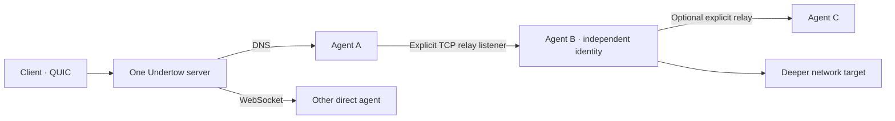

# Agent topology and relays

An Undertow server has one identity, enrollment policy, operator API, route table and job manager. By default it listens on DNS UDP/53, HTTPS/WebSocket TCP/443 and QUIC UDP/443. An agent or client chooses any active carrier independently of other peers. `status` shows each peer's actual carrier, and `transports` lists the server's active listeners and session counts.

The GUI retains disconnected agents and their last known topology paths. You can archive a lost agent from its **Overview** or the Topology right-click menu to hide it from the normal graph and agent list without deleting its history. **Settings → Agents** can show archived records on this client. If the agent calls back, the server automatically unarchives it for every operator.



## Start a relay from the GUI

A relay is a child-agent connection path, not a route for your workstation or a forward to a client service. Read [GUI topology](gui.md#read-the-topology) for graph controls and path colours.

1. Open **Networking → Relays**, select a connected or intentionally sleeping parent, and choose **TCP**. The parent must allow `relay`.
2. Enter a numeric IPv4 bind/port on the parent, e.g. `10.20.1.15:8443`, then **Start relay**. Empty bind uses `0.0.0.0:8443` on all IPv4 interfaces. A sleeping parent shows pending work until its callback. Check that the listener becomes active.
3. Establish inbound reachability from the child network. A local bind does not prove firewall access; follow [Windows inbound permission](#windows-inbound-permission-and-port-scope) below.
4. Click **Create child payload** on the listener. Give the profile a name and **Child reachable relay address**, e.g. `10.20.1.15:8443`. Never dial `0.0.0.0`. Create the profile and build for the child's OS/architecture.
5. Download/deliver the artifact, or enable delivery on the same parent under **Payloads → Artifacts → Host through an agent**. Follow [Agent-hosted payloads](agent-distribution.md#host-a-payload-through-a-connected-agent). Run the helper or binary on the child; generating it does not launch it.
6. When the child calls back, open **Topology** or **Agents**. It has its own identity and workspace. Accept the **child's** network under Routes for deeper access.
7. Stop the listener from Relays or its Topology context menu when no longer needed, reviewing the confirmation. This removes its saved configuration and can interrupt child connections.

An active or restoring listener and connected children keep a check-in parent connected. Saved listeners reopen after that same parent reconnects; a failed rebind appears in diagnostics and requires attention. Agent-hosted artifact delivery tokens do not survive that reconnect and must be enabled again. For Windows pipes, use the [SMB relay GUI workflow](smb-named-pipe-relays.md#use-the-browser-gui).

## Enable a relay only where needed

Relays have **zero listeners by default**. In the server or connected client console, select the parent agent:

```text
agents
use 1
relay start 10.20.1.15:8443
relay list
topology
```

For a TCP relay, the bind must be a numeric IPv4 address and port on that parent. Omitting it listens on `0.0.0.0:8443`, across all parent IPv4 interfaces. Choose a specific interface address if the listener should use only that interface. Give the child the parent's reachable IP or hostname, such as `10.20.1.15:8443`; `0.0.0.0` is a bind address and cannot be the child's destination. **A successful `relay start` proves only that the parent bound a local socket.** The parent's host firewall and any intervening firewall must permit inbound traffic from the intended child. On Windows, an allow decision can be tied to the executable's full path; running a new payload from a different path may trigger a new firewall prompt or automatic block even when an earlier agent binary could listen. Merely placing a binary on Desktop does not grant access. Test from the actual child network with `Test-NetConnection PARENT_IP -Port 8443` before using a deploy helper. Undertow does not change firewall rules. Stop the listener with `relay stop 0.0.0.0:8443` when using the default; `relay stop` without a bind works when exactly one relay is active on that agent. A listener closes when its parent agent disconnects.

### Windows inbound permission and port scope

Windows Firewall treats a new inbound listener as a request for network access. [Microsoft's firewall guidance](https://learn.microsoft.com/en-us/windows/security/operating-system-security/network-security/windows-firewall/rules#applications-rules) explains the outcomes:

| Parent process and policy | Expected result |
| --- | --- |
| An existing allow rule matches the agent's full executable path, network profile, protocol, port, and remote scope | TCP can be reached from hosts covered by that rule. The agent can run at medium integrity. |
| A new path has no matching allow rule; the signed-in user is a local administrator and sees the firewall prompt | The administrator can approve the inbound exception. Declining or dismissing it creates block rules. A process having high integrity does **not** itself approve the exception. |
| A new path has no matching allow rule; the signed-in user is not a local administrator and sees the prompt | Windows creates block rules regardless of the response. `relay start` may still report a successful local bind. |
| No matching allow rule and firewall notifications are disabled or cannot be shown to the operator | The default inbound block still applies; no prompt or new allow rule should be assumed. Background execution cannot be relied on to surface an interactive prompt. |
| An explicit block rule matches | The block takes precedence over a conflicting allow rule. |

**UAC elevation and the Windows Firewall access prompt are different decisions.** High integrity is neither a requirement nor a guarantee for a TCP relay; the effective inbound policy determines reachability. The Microsoft guidance refers to whether the *user* has administrator permissions and whether that user can act on the prompt, rather than an agent automatically obtaining permission from its integrity level. A firewall rule may cover one port or all ports, one profile or several, and a restricted set of remote addresses. A rule for one executable path does not apply to a copy at another path. In one live test, a Windows `TCP Query User` allow rule for an agent executable had no local-port restriction: a medium integrity agent accepted remote connections on both 8443 and 8444 under that same rule. That does not predict the result on a fresh host or new executable path. Verify the effective policy and test from the intended child network for each deployment.

On Linux, a non-root process can normally bind 8443: the [default first unprivileged port is 1024](https://kernel.org/doc/html/v6.12/networking/ip-sysctl.html), configurable per network namespace. A Linux firewall, container policy, or upstream network device can still block inbound traffic after a successful bind. Windows also permits the observed medium integrity agent to bind 8443; its failure in this case was inbound firewall filtering, not a privileged-port restriction. On both platforms, treat a successful bind and a successful connection from the intended child as separate checks.

Start a manual child with its **own** agent key and the original server's enrollment token and fingerprint:

```sh
undertow agent --transport relay --server 10.20.1.15:8443 \
  --fingerprint FINGERPRINT --token-file token.key --agent-key child.key
```

The child connects only to the parent address. The parent carries its bytes over the existing session to the original server. The child authenticates directly to that server using the normal Undertow identity and enrollment handshake; the parent does not inherit the child's routes, inventory, files or permissions. `--transport relay` uses Undertow's end-to-end encrypted session rather than a separate TLS certificate at the internal listener. Provide `--fingerprint` or a trusted `--fingerprint-file`; relay cannot discover a trustworthy fingerprint by itself.

For a configured child payload, create a profile with `server=INTERNAL_IP:PORT transport=relay` after starting the parent listener. Build for the child's OS and architecture. You have two explicit delivery choices:

- **Server HTTPS listener:** run `payload retrieval-host set PUBLIC_SERVER_HOST`, then `payload host PAYLOAD_ID`. The download URL points at the server while the built agent still connects through the parent's relay. See [public HTTPS download host](agent-distribution.md#public-https-download-host).
- **Parent's existing TCP relay listener:** run `payload host-agent PAYLOAD_ID PARENT_AGENT_ID RELAY_BIND PUBLIC_HOST`. The parent fetches artifact bytes through its current Undertow session and serves the opaque HTTPS URL on the **same relay address and port** that accepts children. Use `payload deploy-script-agent HOST_ID powershell|shell` for a pinned, hash-checking helper. See [host a payload through a connected agent](agent-distribution.md#host-a-payload-through-a-connected-agent). No additional server HTTPS listener is involved.

The server presents each child as a separate agent. Use `topology` or `agents` to see `direct` and `via PARENT` paths. The GUI topology connects a child to the particular relay listener that carried its session; the server records that bind on new connections. For older agent versions, it can identify the listener when the parent has only one active listener of that carrier type. When several older listeners of the same type could match, it shows the parent path without guessing. Select a child normally with `use NUMBER`; its `show`, `routes`, `shell`, `exec`, files, jobs, scripts, WASM and forwards target that child. Client route acceptance also selects the child, so the client can reach its deeper network through the parent automatically.

An agent can itself host a relay after it joins through another relay. Depth is limited to eight relay links, and an agent cannot relay to itself or create a parent loop. The server rejects an invalid or excessive chain. A parent disconnect closes its descendant sessions and deactivates their routes. The server retains the bind of each successfully started relay listener and reopens it when that same parent agent reconnects and reports its relay capability. Children then retry through their normal reconnect policy. `relay stop` removes the retained configuration. If rebinding fails because the address is occupied or the host no longer permits it, the server logs the failure and the listener is absent from the live relay list; the graph may still show the last known disconnected path. Server versions before this change did not retain listener configuration, so listeners started under those versions need to be started once more after upgrading.

On Windows, a parent can instead listen on an SMB named pipe. The child uses `--transport relay-smb` with a UNC pipe path; the same end-to-end Undertow session and separate child identity apply. The terminal `relay start \\.\pipe\NAME` command and **Networking → Relays** in the GUI can start this listener. The existing pipe can also serve a built Windows payload through a pinned PowerShell helper; it is not an HTTPS URL. SMB service reachability and Windows authentication must already work between the hosts. Follow the [Windows SMB named-pipe relay guide](smb-named-pipe-relays.md) for exact paths, access requirements, payload delivery, and stop procedure.

`--deny=relay` on an agent rejects relay listener requests while leaving its other capabilities available. `relay` is independent of `listeners`, which controls agent-side TCP forwards for client services. No relay port is opened just because the capability is allowed. The relay listener and child session do not change host adapters or routes.

## Mixed carrier path

This route is valid when the server's DNS and QUIC listeners are active:

```text
Client --transport quic --internal
  → server QUIC UDP/443
  → server route selection
  → Agent A over DNS UDP/53
  → explicit relay on A
  → Agent B
  → deeper target
```

The client selects B's advertised route in its console with `agents`, `use NUMBER`, `routes`, `route accept CIDR` (or `route add CIDR`). Verify with TCP, UDP or ICMP against a target that B can reach. The selected route belongs to B, not A. A's carrier, the client's carrier and the internal relay connection are independent.

For the first server, client, and agent, use [Getting started](getting-started.md); for route choices, use [Networking modes and transports](networking-modes.md). Standalone route commands and flags for automation are in the [CLI reference](cli-reference.md). The underlying framing is described in the [protocol reference](protocol.md).

Back to [documentation home](README.md).
