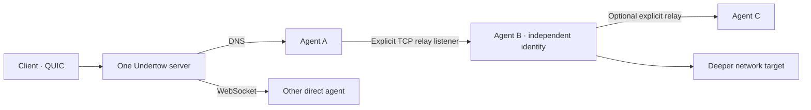

# Agent topology and relays

An Undertow server has one identity, enrollment policy, operator API, route table and job manager. By default it listens on DNS UDP/53, HTTPS/WebSocket TCP/443 and QUIC UDP/443. An agent or client chooses any active carrier independently of other peers. `status` shows each peer's actual carrier, and `transports` lists the server's active listeners and session counts.



## Enable a relay only where needed

Relays have **zero listeners by default**. In the server or connected client console, select the parent agent:

```text
agents
use 1
relay start 10.20.1.15:8443
relay list
topology
```

For a TCP relay, the bind must be a numeric IPv4 address and port on that parent. Omit it for the safe loopback default `127.0.0.1:8443`; specify an internal interface address for a child on another host. `0.0.0.0:8443` accepts on all IPv4 interfaces only when explicitly entered. Permit the port in the parent host's firewall only for intended children. Stop it with `relay stop 10.20.1.15:8443`; `relay stop` without a bind works when exactly one relay is active on that agent. A listener closes when its parent agent disconnects.

Start a manual child with its **own** agent key and the original server's enrollment token and fingerprint:

```sh
undertow agent --transport relay --server 10.20.1.15:8443 \
  --fingerprint FINGERPRINT --token-file token.key --agent-key child.key
```

The child connects only to the parent address. The parent carries its bytes over the existing session to the original server. The child authenticates directly to that server using the normal Undertow identity and enrollment handshake; the parent does not inherit the child's routes, inventory, files or permissions. `--transport relay` uses Undertow's end-to-end encrypted session rather than a separate TLS certificate at the internal listener. Provide `--fingerprint` or a trusted `--fingerprint-file`; relay cannot discover a trustworthy fingerprint by itself.

For a configured child payload, create a profile with `server=INTERNAL_IP:PORT transport=relay` after starting the parent listener. Build for the child's OS and architecture. You have two explicit delivery choices:

- **Server HTTPS listener:** run `payload retrieval-host set PUBLIC_SERVER_HOST`, then `payload host PAYLOAD_ID`. The download URL points at the server while the built agent still connects through the parent's relay. See [public HTTPS download host](agent-distribution.md#public-https-download-host).
- **Parent's existing TCP relay listener:** run `payload host-agent PAYLOAD_ID PARENT_AGENT_ID RELAY_BIND PUBLIC_HOST`. The parent fetches artifact bytes through its current Undertow session and serves the opaque HTTPS URL on the **same relay address and port** that accepts children. Use `payload deploy-script-agent HOST_ID powershell|shell` for a pinned, hash-checking helper. See [host a payload through a connected agent](agent-distribution.md#host-a-payload-through-a-connected-agent). No additional server HTTPS listener is involved.

The server presents each child as a separate agent. Use `topology` or `agents` to see `direct` and `via PARENT` paths. Select a child normally with `use NUMBER`; its `show`, `routes`, `shell`, `exec`, files, jobs, scripts, WASM and forwards target that child. Client route acceptance also selects the child, so the client can reach its deeper network through the parent automatically.

An agent can itself host a relay after it joins through another relay. Depth is limited to eight relay links, and an agent cannot relay to itself or create a parent loop. The server rejects an invalid or excessive chain. A parent disconnect closes its descendant sessions and deactivates their routes; children reconnect through the parent when it returns. Relay listeners are session scoped and must be started again after the parent reconnects.

On Windows, a parent can instead listen on an SMB named pipe. The child uses `--transport relay-smb` with a UNC pipe path; the same end-to-end Undertow session and separate child identity apply. The terminal `relay start \\.\pipe\NAME` command and **Relays** in the GUI can start this listener. A named pipe is not an HTTPS download URL; use `payload download PAYLOAD_ID` or another delivery channel for the Windows child build. Follow the [Windows SMB named-pipe relay guide](smb-named-pipe-relays.md) for exact paths, Windows access requirements, profile build, and stop procedure.

`--deny=relay` on an agent rejects relay listener requests while leaving its other capabilities available. `relay` is independent of `listeners`, which controls agent-side TCP forwards for client services. No relay port is opened just because the capability is allowed. The relay listener and child session do not change host adapters or routes.

## Mixed carrier path

This route is valid when the server's DNS and QUIC listeners are active:

```text
Client --transport quic --internal
  → server QUIC UDP/443
  → server route selection
  → Agent A over DNS UDP/53
  → explicit relay on A
  → Agent B
  → deeper target
```

The client selects B's advertised route in its console with `agents`, `use NUMBER`, `routes`, `route accept CIDR` (or `route add CIDR`). Verify with TCP, UDP or ICMP against a target that B can reach. The selected route belongs to B, not A. A's carrier, the client's carrier and the internal relay connection are independent.

For the first server, client, and agent, use [Getting started](getting-started.md); for route choices, use [Networking modes and transports](networking-modes.md). Standalone route commands and flags for automation are in the [CLI reference](cli-reference.md). The underlying framing is described in the [protocol reference](protocol.md).

Back to [documentation home](README.md).
